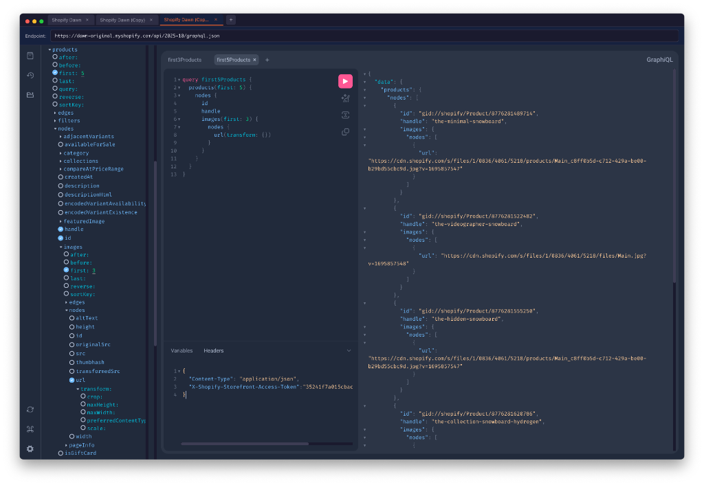

# GraphiQL Desktop

A modern, privacy-focused desktop app for [GraphiQL](https://github.com/graphql/graphiql) — the official GraphQL IDE.



## ✨ Features

- **Built on Official GraphiQL** — Always up-to-date with the latest [graphql/graphiql](https://github.com/graphql/graphiql) core
- **Native Desktop Experience** — Powered by Electron for macOS (Apple Silicon)
- **Multi-Endpoint Tabs** — Work with multiple GraphQL APIs simultaneously
- **Independent Query Sessions** — Each endpoint maintains its own query tabs, variables, and headers
- **100% Local Storage** — All data stays on your machine. No telemetry, no cloud sync, no uploads.
- **Schema Explorer** — Built-in documentation explorer for easy query building

## 🔒 Privacy First

Your queries, headers, and API tokens are stored locally in your browser's localStorage. **Nothing is ever sent to external servers** (except your GraphQL requests to the endpoints you specify).

## 📥 Download

Download the latest release from [GitHub Releases](https://github.com/benjaminv/graphiql-app/releases).

> **Note**: The app is unsigned. To open on macOS 15+ (Sequoia):
> ```bash
> xattr -dr com.apple.quarantine /Applications/GraphiQL\ Desktop.app
> ```
> For older macOS versions: Right-click → Open → Open

## 🛠 Development

```bash
# Install dependencies
npm install

# Run in development mode
npm run dev

# Build for production (macOS Apple Silicon)
npm run electron:build
```

## 📄 License

MIT
